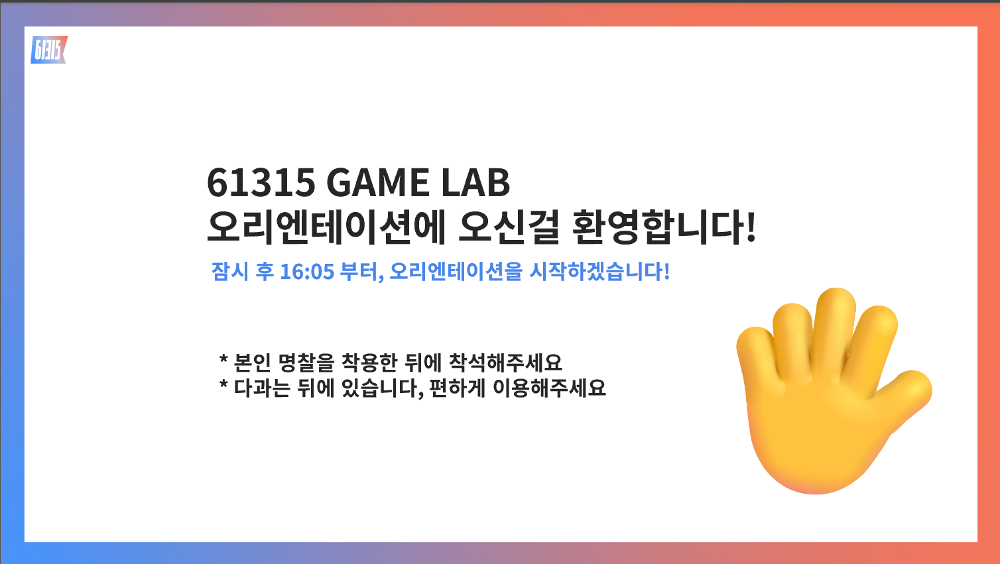
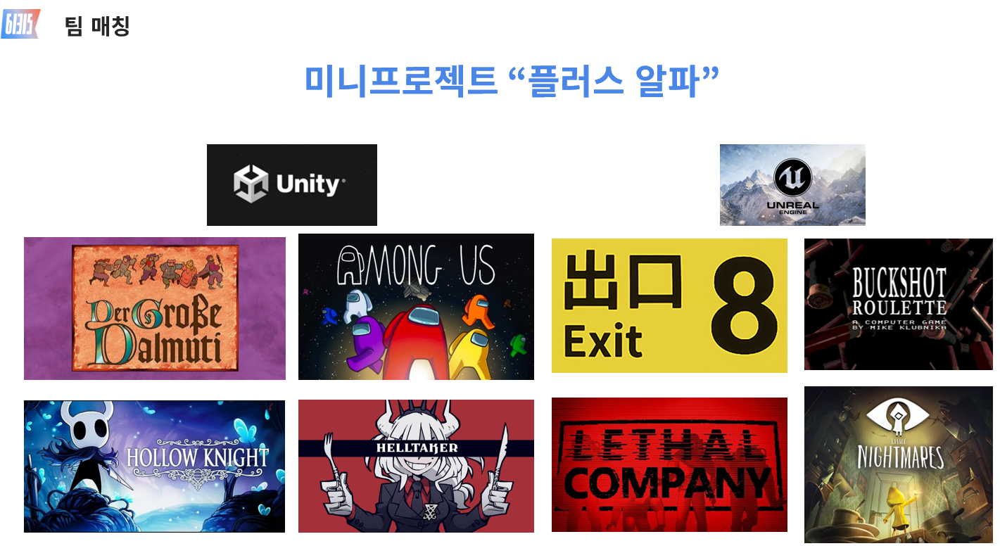
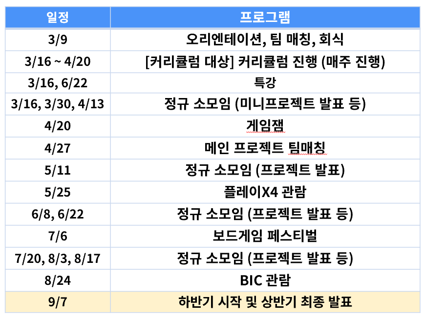

+++
title = "A250309"
date = "2025-03-09"
draft = false
description = "🎉 새로 오신 여러분들을 환영합니다 🎉"
categories = [
    "activity"
]
tags = [
    "activity"
]
image = "image1.png"
+++

유난히 경쟁률이 높았던 61315 GAMELAB의 2025년 상반기 오리엔테이션이 진행되었습니다.    
인터뷰 등은 모두 온라인으로 진행되기에 실제로 대면하는 것은 처음이라 저희도 많이 떨렸는데요!    
다행히 다들 잘 반영해주셔서 아주 좋은 분위기로 진행될 수 있었습니다.    

오리엔테이션은 상반기 운영안 발표 - 아이스브레이킹 - 2024년 결과물 전시 - 미니프로젝트 팀매칭 순서로 진행되었으며, 2024년 결과물 전시에는 제작이 완료된 9개의 미니/메인프로젝트의 결과물들을 시연하는 자리로 진행되었어요.    

이번 학기 초반 2개월 간 진행되는 미니프로젝트는 “플러스 알파”라는 주제로, 유명한 게임의 핵심 아이디어를 변형하고 개선해서 독창적인 게임을 개발하는 프로젝트로 진행되었어요.    
결과적으로 **달무티, 어몽어스, 8번 출구, 리썰컴퍼니**의 4개의 게임이 선정되어 팀매칭이 진행되었답니다!    

