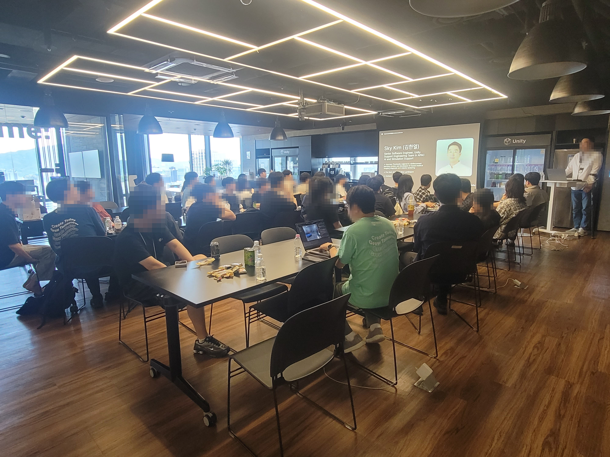
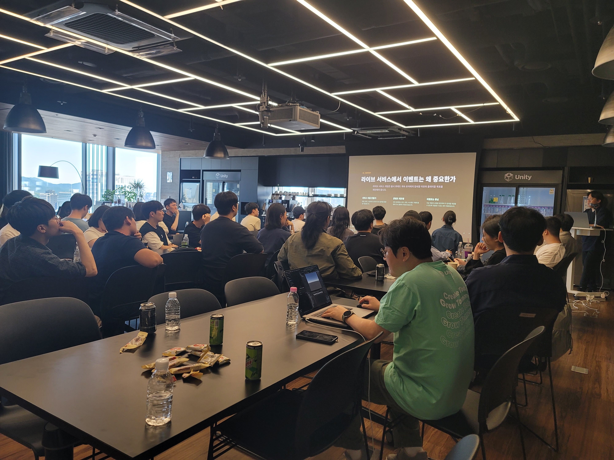
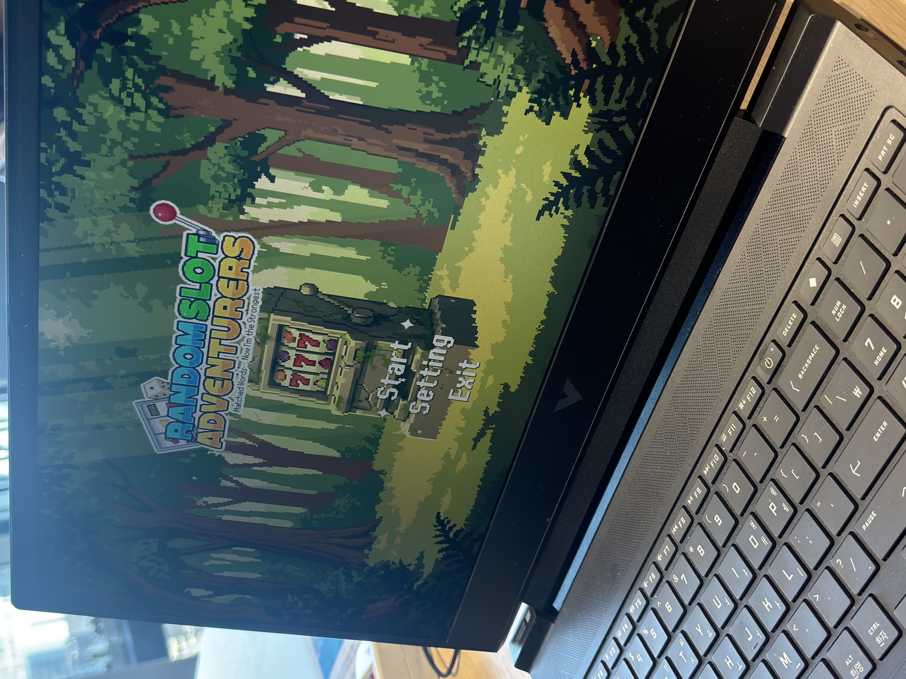
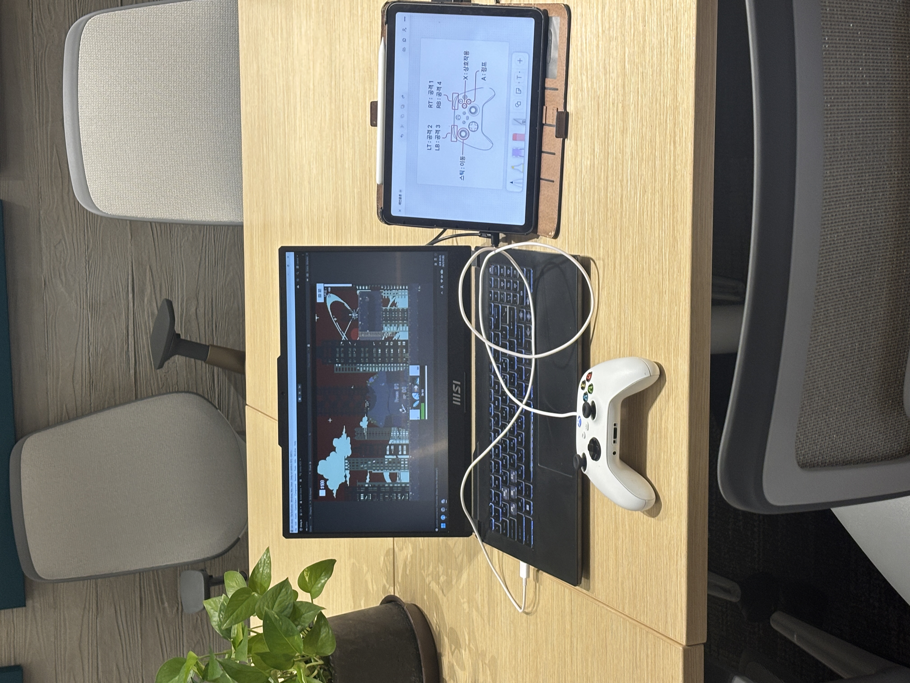

+++
title = "CON:61315 🔥"
date = "2026-05-31"
draft = false
description = "유니티 코리아에서 진행된 데모데이와 다양한 특강 세션들🔥"
categories = [
    "activity"
]
tags = [
    "activity"
]
image = "KakaoTalk_Photo_2026-07-05-19-57-52.jpeg"
+++

유니티 코리아 사옥에서 61315 GAMELAB에서 최초로 진행된 미니 컨퍼런스 CON:61315를 진행하였습니다.

유니티 코리아에서는 김범주 APAC 애드버킷 본부장님과, 김한얼 시니어 소프트웨어 엔지니어님이 참가해주셨고,
우리 모임에서는 넥슨 유니버스 김동현님, 브레이브 비기너즈 김명민님이 발표 세션을 진행해주셨습니다.

데모 데이와 피자 네트워킹 등 전반적으로 알찬 세션들을 진행하였습니다!
