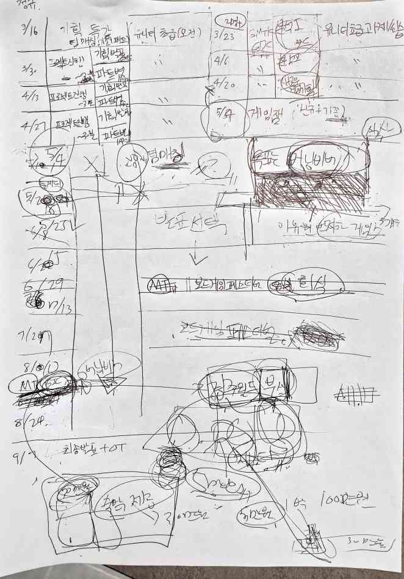
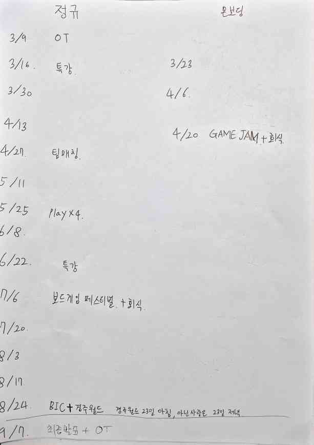

+++
title = "M250222"
date = "2025-02-21"
draft = true
description = "2025.02.22 회의록"
categories = [
    "meeting"
]
tags = [
    "meeting"
]
+++

## 시스템

### 2025-1 계획표 점검

### 온보딩
* 프로그램 초안 논의 완료
* 추가 의견 제시

### 파트별 반 분리
* 기대 효과
  * 더 발전적인 대화 가능
  * 스터디 수요 조사 용이
  * 운영진 의존적 구조 분산 가능
* 우려 사항
  * 파트별 분단 고착화

### 목표, 정체성
* 광의: 게임 개발자 모임
* 협의: ???.. 팀 짜서 프로젝트 만드는 곳?
* 큰 카테고리는 있지만 각자 생각이 다를 수 있음
* 생각을 종합해서 명시하면 방향성 정하기 가능

### 규칙
* 정리하면 좋을 듯
* 운영 방침 (공개+내부), 모임원 규칙

## 모두의 참여

### 토론 문화 도입
* 발표 위주도 나쁘진 않지만 뒷심 부족, 지침
* 사회자 or 공동 서기로 보완
* 토론이 아니어도 스터디 의욕 증진 아이디어 제시 환영

### 공동 서기
* 자유 형식으로 스터디 진행 사항 적어보기
* 스터디 종료 후 모아서 종합
* 논의 후 모두가 생각한 스터디의 핵심을 적어서 게시

### 시즌 반장
* 운영진은 아니지만 이끌어갈 사람
* 우리가 뽑은 대표가 이끈다는 기여감
* 중도 이탈 방지 효과 기대
* 정하는 시기는 온보딩 중 or 후

## 학생과 직장인

### 분리 관리 필요성?
* 사용할 수 있는 시간의 차이 존재함
* 기대 효과
  * 방학 기간 활용 등 프로그램 최적화
  * 서로 니즈가 다를 수 있음
* 우려 사항
  * 분단 가능성

### 방학 기간 활용
* 시험 핑계 못대는 기간
* 집중 활동 가능

## 기타

### 사이클 도입

### 소심한 사람들 참여 독려
* 어려운 문제..
* 완전 해결은 안되지만 최소화를 위한 지속적인 논의는 필요