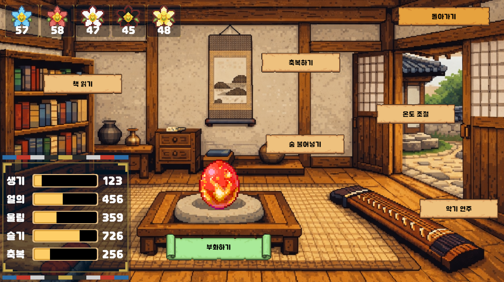
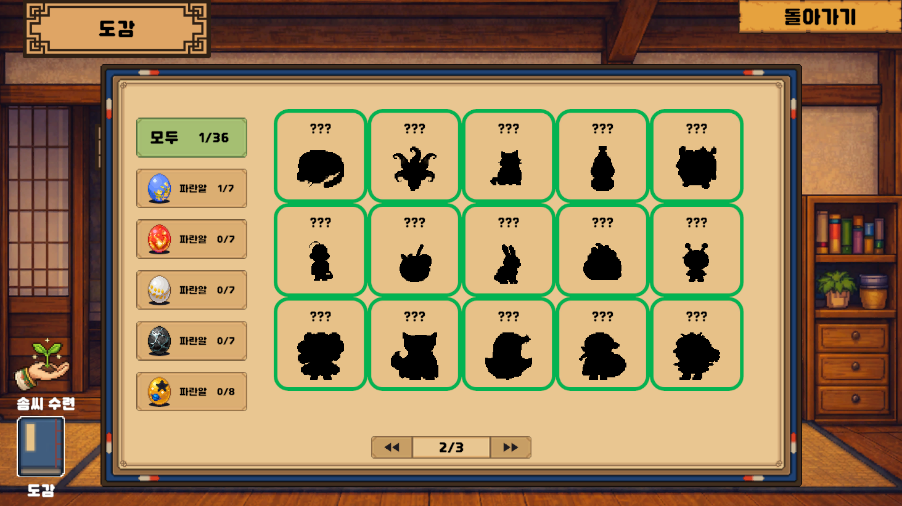

+++
title = "리듬 오브 파이브! [Rhythm of Five]"
date = "2026-09-26"
draft = false
description = "한국 신화 기반의 리듬 × 육성 게임 리듬 오브 파이브! 오방신의 알을 리듬으로 돌보는 k-리듬게임!"
categories = [
    "project"
]
tags = [
    "project",
    "rhythm",
    "pixelart",
    "steam"
]
image = "title.PNG"
+++

스팀 링크 : https://store.steampowered.com/app/4908060

## 오방신의 알을 리듬으로 깨워라!

서천꽃밭에서 견습 삼신의 이야기가 시작됩니다.

■ 거문고 가락에 맞춰 연주하라

거문고 줄 위로 흘러오는 노트를 D · F · J · K로 연주하세요.
청룡의 용궁해부터 황룡의 천문대까지, 다섯 세계의 음악이 기다리고 있습니다.

■ 스페이스바 하나로 알을 돌보라

리듬 게임에서 모은 오색 꽃으로 알을 돌보세요.
숨 불어넣기, 온기 나누기, 악기 연주, 이야기 들려주기, 축복하기.
다섯 가지 미니게임 모두 스페이스바 하나면 충분합니다.

■ 무엇이 태어날지 아무도 모른다

어떤 스탯을 키웠는지에 따라 부화 결과가 달라집니다.
꽝부터 신화 등급까지, 나만의 도감을 완성하세요.

■ 다채로운 콘텐츠

5개의 챕터
31개의 스테이지
5종의 육성 미니게임
36종의 수집 캐릭터
16개의 스킬

2026년 하반기, 스팀에서 만나요.
지금 찜해두고 삼신할미의 뒤를 이을 준비를 해주세요!

()
